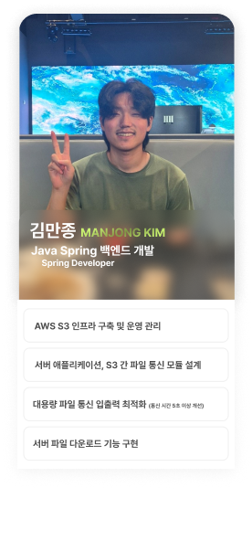
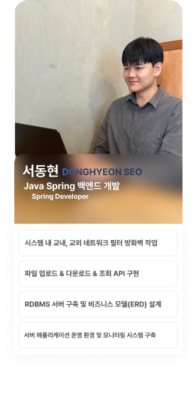
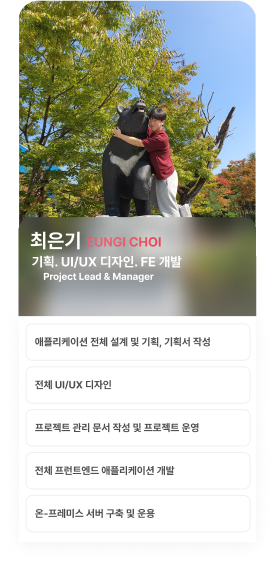

# Hanbat BOX 


> 교내에서 어떤 디바이스로든 접근할 수 있다.

# 개요

## >> [👉 서비스 접속하기](http://galaxy4276.asuscomm.com:3000)

해당 프로젝트는 한밭대학교 교내의 다양한 상황에서(*하단 표 자료 참고*) 손쉽게 타인 간 자료를 공유하게 끔 하여 작업 능률이나 교육 품질을 향상을 목표로 합니다

또한 서비스 접근에 있어 제약이나 조건이 존재하지 않도록 모든 기기에서 접근할 수 있도록 설계하여 교내에서 교육 또는 작업 간 어떤 상황에서도 손쉽게 사용할 수 있습니다.

> *2024년 소중한 오픈소스 활용 SW경진대회* 작품입니다. 


|학생|교직원|
|---|---|
|강의 중 교수님이 언급하신 추가 자료를 친구가 가지고 있어서 수업이 끝나기 전에 파일을 받고 싶다.|강의 도중 필요한 추가 자료나 예제 파일을 즉시 학생들에게 배포하고 싶다|
|시험 준비를 하면서 친구들이 정리한 필기나 요약본을 서로 빠르게 공유하고 싶다.|다른 교수님들과 교내 행사나 프로젝트 준비에 필요한 자료를 빠르게 공유하고 싶다.|
|동아리 모임에서 바로 참고해야 할 자료를 모임 중에 공유하고, 여러 사람들에게 즉시 전달하고 싶다.|학과 회의 중 회의록이나 발표 자료를 다른 교직원들과 바로 공유하고, 수정된 파일을 즉시 전달받고 싶다|
|학과 행사나 세미나 중에 발표자료, 사진, 이벤트 결과 파일 등을 참석자 간에 즉시 공유하고 싶다.|연구 자료나 발표 자료를 다른 교수님들과 빠르게 공유하고 피드백을 받고 싶다.|
|과제를 함께 진행하는 친구에게 중간 작업물을 보내서 피드백을 바로 받고 싶다.|교내 긴급 상황에서 빠르게 소통하고 필요한 파일을 교직원들에게 즉시 전송하고 싶다.|

|산출 자료|
|---|
|[UI/UX 디자인 시안](https://www.figma.com/design/6nbsuCKu6zPYzZoEVEVE5j/Hanbat-Box?node-id=0-1&t=l3Q20hkdXyx0Hoe4-1)|
|[기획서](https://drive.google.com/file/d/1lX45Gdu32BcGZojJQDlCTYprDDU476qA/view?usp=sharing)|
|[프레젠테이션](https://drive.google.com/file/d/1lX45Gdu32BcGZojJQDlCTYprDDU476qA/view?usp=sharing)|


# 주요 기능
### 교내 네트워크 기반 접근 제어
* 교내 공인 네트워크 여부를 필터링하는 계층을 구축하여 교내/교외 서비스 접근을 제어하고 교내에서 로그인 없이 이용가능하게 끔 하여 보안성과 사용성을 용이하게 하였습니다.

### 다운로드 링크 기능 제공
* 자료 업로더는 타인에게 다운로드 링크를 제공하여 쉽고 빠른 자료 공유를 수행할 수 있습니다.

### 암호화 공유
* 파일에 대해 해시 암호화 및 다운로더에게 암호를 요구하여 업로드한 파일을 타인으로부터 안전하게 보호할 수 있습니다.


# 팀원 소개
|김만종|서동현|최은기|
|---|---|---|
||||
|Java Spring 백엔드 개발|Java Spring 백엔드 개발|기획, UI/UX 디자인, FE 개발|
|AWS S3 인프라 구축 및 운영 관리|시스템 내 교내, 교외 네트워크 필터 방화벽 작업|애플리케이션 전체 설계 및 기획, 기획서 작성|
|서버 애플리케이션, S3 간 파일 통신 모듈 설계|파일 업로드 & 다운로드 & 조회 API 구현|전체 UI/UX 디자인|
|대용량 파일 통신 입출력 최적화|RDBMS 서버 구축 및 비즈니스 모델 설계|프로젝트 관리 문서 작성 및 프로젝트 운영|
|서버 파일 다운로드 기능 구현|서버 애플리케이션 운영 환경 및 모니터링 시스템 구축|전체 프런트엔드 애플리케이션 개발|
|||온-프레미스 서버 구축 및 운용|


# 실행 방법

> 도커 환경 기반으로 안내드립니다.

### 1. 환경변수 작성
`app/.env` 를 작성합니다.

```bash
cp app/.env.example app/.env
...
VITE_API_ENDPOINT=#서버 엔드포인트 작성
```

`hanbotbox-api/.env` 를 작성합니다.

```bash
cp app/.env.example app/.env
...
POSTGRES_DB=#데이터베이스
POSTGRES_USER=#RDB 사용자명
POSTGRES_PASSWORD=#RDB 패스워드명
POSTGRES_DB_HOST=#RDB 호스트
BUCKET_NAME=#AWS S3 Bucket 이름
ACCESS_KEY_ID=#AWS S3 Bucket 접근키
ACCESS_SECRET=#AWS 비밀키
SECURITY_PASSWORD=#앱 임의 비밀번호(30자 이상)
SECURITY_USER=#앱 관리자 이름
```

### 2. 실행

각각의 디렉터리 파트에서 `docker compose up` 을 수행하여 애플리케이션을 로드합니다.
```bash
// cd ./app
docker compose up -d # run nginx application

// cd ./hanbotbox-api
docker compose up -d # run gradle build & spring, rdb application
```


# 사용된 기술
<p float="left">


</p>
